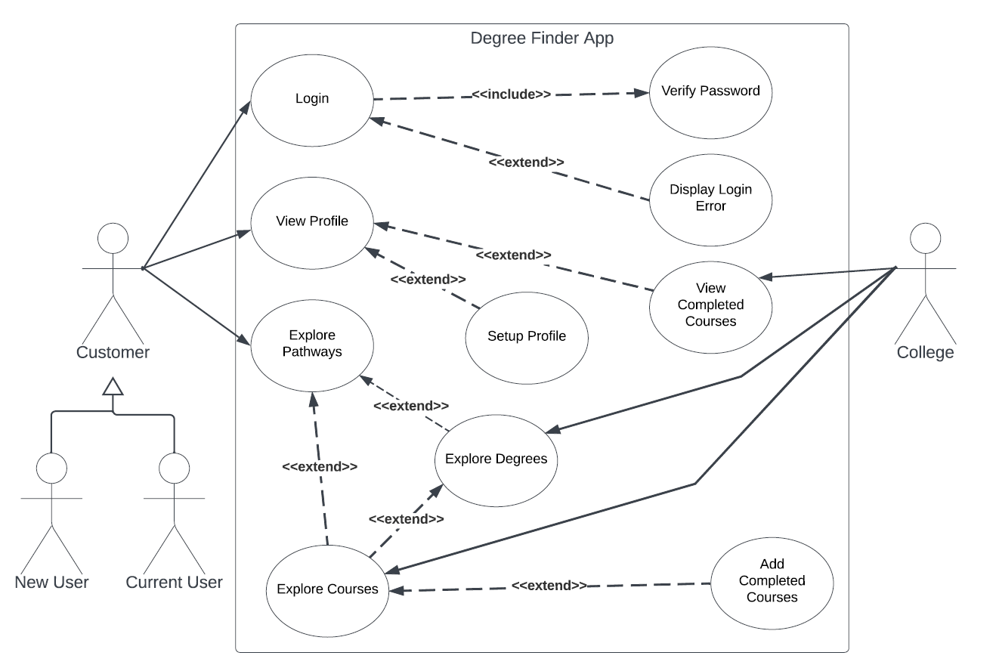

# DegreeFinder web-based app
    Created with Django

Goal: Connect colleges with prospective students.

As a student sometimes it is difficult to discover which particular topics are of interest when pursuing a career. Also, registration and advising assistance varies from college to college. The goal of this app is to allow students to explore Pathways of interest and locate the colleges that offer degrees that best suit their interests. 
  
The app would allow colleges to upload their information to the DegreeFinder database where it can be viewed by potential students. Students would then be able to browse by topical interest via the Pathways option and narrow the scope of the search by seeing available degrees or certificates associated with that Pathway. Finally, they would be able to see course schedules pertaining to that degree and easy-to-follow steps to apply and register for classes through the offering college.
  
### USE CASE

